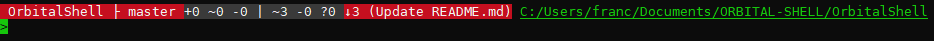
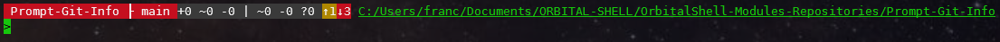
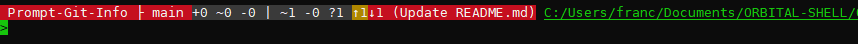

# Prompt Git Info
Module for Orbital Shell

Add custom text to the prompt of console showing the status of git repositories if the current directory is above a repository folder


 
 
<br>


<br>


### Usage

install into the shell:
```shell
> module -i prompt-git-info
```
disable/enable:
```shell
> prompt-info -e false
> prompt-info -e true
```

### Preview

up to date


worktree changed


index changed


ahead


behind


behind + behind message



ahead/behind



ahead/behind + behind message



no repo


<br>
<br>

### Settings

namespace **env.com.git.promptInfo**

variable | type | value
-- | -- | --
isEnabled                          | bool                | true
isEnabledGetRemoteStatus           | bool                | true
runInBackgroundTask                | bool                | fals|e
infoBackgroundColor                | string              | \e[48;5;237|m
modifiedTextTemplate               | string              | %bgColor%(f=w|hite) %repoName% ├ %branch% %sepSymbol%%errorMessage%\e[48;5;237m+%indexAdded% ~%indexChanges% -%indexDeleted% \| ~%worktreeChanges% -%worktreeDeleted% ?%untracked%(rdc|)
behindTextTemplate                 | string              | %bgColor%(f=white) %repoName% ├ %branch% %sepSymbol%%errorMessage%\e[48;5;237m+%indexAdded% ~%indexChanges% -%indexDeleted% \| ~%worktreeChanges% -%worktreeDeleted% ?%untracked% (b=darkred)↓%behind%%behindMessage%(rdc)
aheadBehindTextTemplate            | string              | %bgColor%(f=white) %repoName% ├ %branch% %sepSymbol%%errorMessage%\e[48;5;237m+%indexAdded% ~%indexChanges% -%indexDeleted% \| ~%worktreeChanges% -%worktreeDeleted% ?%untracked% \e[48;5;136m↑%ahead%(b=darkred)↓%behind%%behindMessage%(rdc)
aheadTextTemplate                  | string              | %bgColor%(f=white) %repoName% ├ %branch% %sepSymbol%%errorMessage%\e[48;5;237m+%indexAdded% ~%indexChanges% -%indexDeleted% \| ~%worktreeChanges% -%worktreeDeleted% ?%untracked% \e[48;5;136m↑%ahead%(rdc)
noDataTextTemplate                 | string              | %bgColor%(f=white) %repoName% ├ %branch% %errorMessage%(rdc)
templateNoRepository               | string              | (b=darkblue)(f=white) » %errorMessage%(rdc)
behindBackgroundColor              | string              | (b=darkred)
aheadBackgroundColor               | string              | \e[48;5;136m
upToDateBackgroundColor            | string              | \e[48;5;22m
modifiedBackgroundColor            | string              | \e[48;5;130m
modifiedUntrackedBackgroundColor   | string              | \e[48;5;166m
unknownBackgroundColor             | string              | (b=darkblue)

<br>

### Settings example

change behin background color, for example within user **.profile** script :

```shell
set env.com.git.promptInfo.behindBackgroundColor (b=magenta)
```

<br><br><br>

<hr>

<br>

<b>Orbital Shell</b> is a multi-plateform (**windows, linux, macos, arm**) command shell, inspired by <b><i>bash</i></b> and POSIX recommendations. It provides any usual bash shell feature (even if modernized) and nice syntaxes and features allowing to interact (get/set/call members) with C# objects. Developed using **C# 8, .NET Core 3.1/Net 5 and .NET Standard 2.1**

